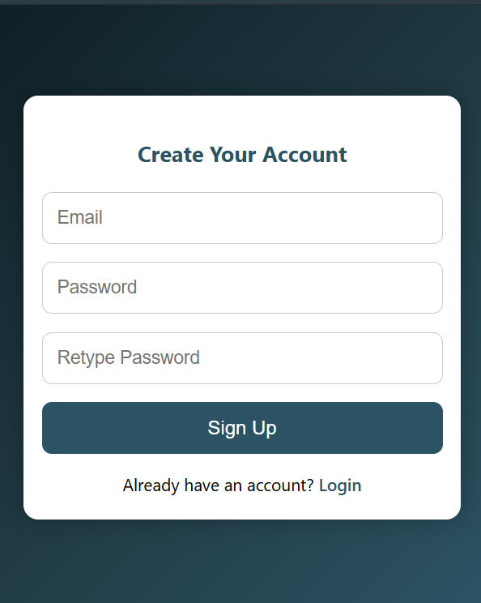
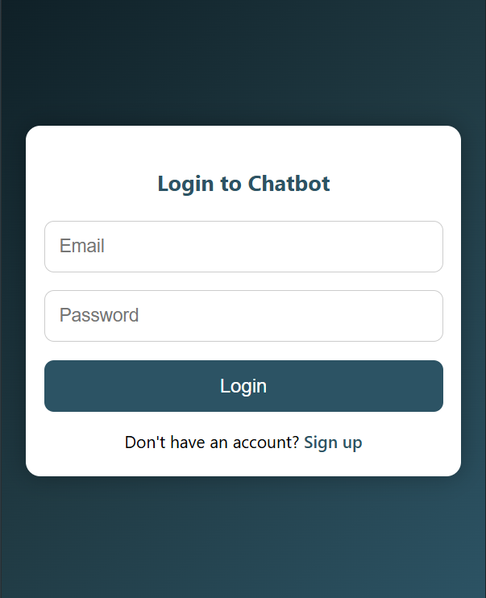
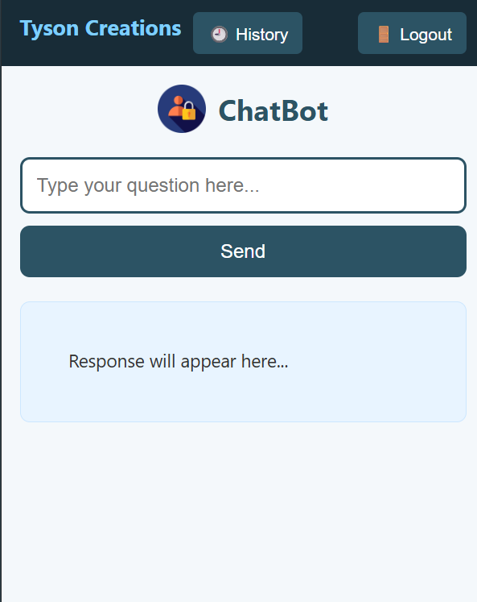

# 📝 Tyson Creations – Chat Assistant App

Tyson Creations is a user-friendly chat assistant web application that allows users to ask questions and receive intelligent responses instantly.

---

## 💬 How It Works

### 🔐 User Sign Up
New users can create an account by providing their email and setting a secure password.  
A confirmation message is shown after signing up.

### 🔓 User Login
Existing users can log in using their credentials.  
Once logged in, they are redirected to the chat page.

### 💡 Asking Questions
Users can type their questions into the input box and click the **"Send"** button.  
The app will process the question and display the answer in real-time.

### 📜 View Chat History
By clicking the **"History"** button, users can view a list of all previously asked questions along with their responses.

### 🚪 Logout
Users can securely log out by clicking the **"Logout"** button, which redirects them back to the login page.

---

## 📱 Mobile-Friendly
The app layout automatically adjusts to different screen sizes,  
offering a smooth experience on both desktop and mobile devices.

---

<h3>🖼️ Screenshots</h3>

  
  
  

